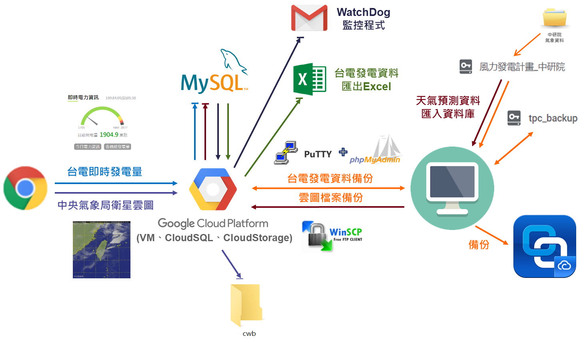

## DeepWind風能預測模式架構開發與驗證計畫執行項目

- 計畫目標為預測風能及太陽能發電量，工作內容為搜集、管理與備份用以預測的資料
1. 爬取台電即時發電量數據與中央氣象局衛星雲圖檔案，並利用監控程式定時通過e-mail回報爬蟲執行狀況
3. 將中研院提供的天氣預測檔案資料匯入 MySQL 資料庫
4. 程式部屬在 GCP_VM，並在 GCP_VM 建立排程執行爬蟲程式，爬取的資料同步儲存在 GCP_VM 與 GCP_cloudSQL & GCP_cloudStorage

### 執行工作架構

### 主要程式
1. 台電即時發電量爬蟲：[tpc_crawler.py](/tpc_crawler.py)
2. 中央氣象局衛星雲圖檔案爬蟲：[cwb_crawler.py](cwb_crawler.py)
3. 爬蟲執行監控：[crawler_watchdog.py](crawler_watchdog.py)
